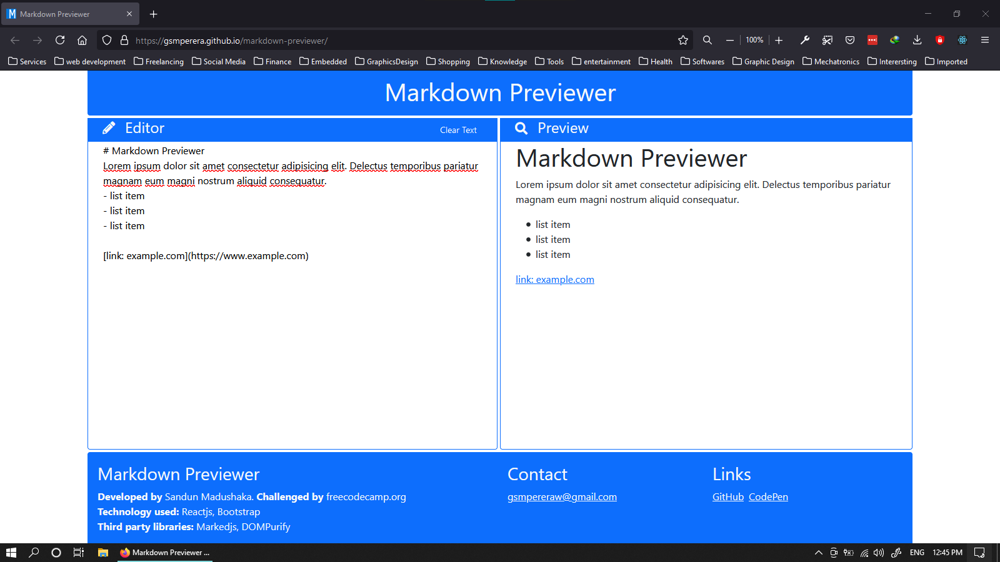
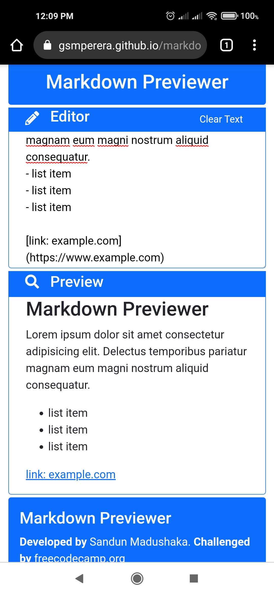
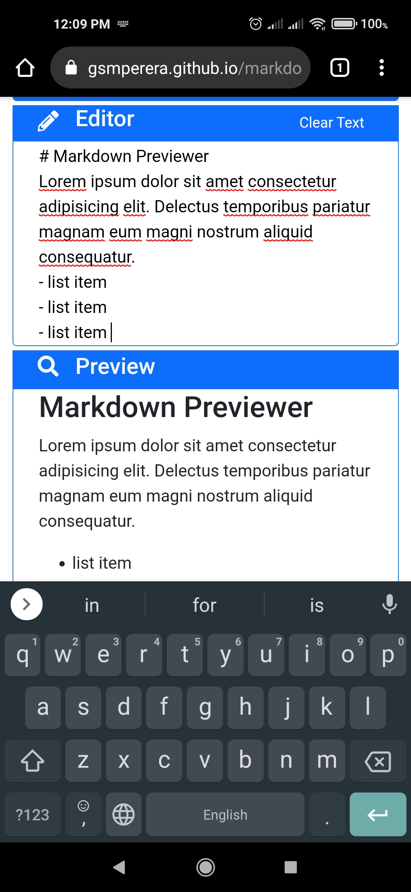

# Markdown Previewer

-   Live website: [markdown-previewer](https://gsmperera.github.io/markdown-previewer/)
-   Realtime Markdown language converting tool.
-   This webapp was created as a freecodecamp.org challenge project.

## Technology Used

-   Reactjs
-   Marked JavaScript library
-   DOMPurify JavaScript library

## Responsive Design

-   desktop view

-   mobile view

 
